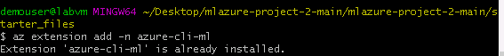

# Operationalizing Machine Learning

*TODO:* Write an overview to your project.
This project is part of the Udacity Azure ML Nanodegree. In this project, we deploy the best model in Azure Machine Learning Studio and we publish an ML pipeline.

## Architectural Diagram
*TODO*: Provide an architectual diagram of the project and give an introduction of each step. An architectural diagram is an image that helps visualize the flow of operations from start to finish. In this case, it has to be related to the completed project, with its various stages that are critical to the overall flow. For example, one stage for managing models could be "using Automated ML to determine the best model". 

We have three main sections in the above architectural diagram:

1- Prepare the dataset
We use this tabular [Bank Marketing dataset](https://automlsamplenotebookdata.blob.core.windows.net/automl-sample-notebook-data/bankmarketing_train.csv). It has 21 attributes including the target 'y'. This dataset aims to predit if a potential client would subscribe to a term deposit or not at the bank. Thus, the target 'y' contains two classes 'yes' and 'no'.

2- Deployment of the best model in Azure ML Studio
We have these 5 following steps to achieve:
  - Create a new Automated Machine Learning experiment
 We use a new compute cluster, so we select "Standard_DS12_v2 for the virtual machine size, and 1 as the minimum number of nodes. Also, we reduce Exit criterion to 1 hour and the Concurrency to 5. Then, we run the experiment using classification, with "Explain best model" checked.
 
  - Deploy the model with Authentication and Azure Container Instance. 
We select the best model "Voting Ensemble", with AUC weighted 0.947, to deploy. Then, we check "Authentication" and Azure Cotainer Instance.

  - Enable Application Insights and retrieve logs
We ensure the command 'az' is installed.

We download 'config.json' and we put it in the same directory as 'logs.py'. The script 'logs.py' enables application insights and print the retrieved logs in the command line.

  - Consume the deployed model using Swagger
In the 'Endpoints' section, where is our deployed model, we download 'swagger.json'. Then, we put it in 'swagger' directory. Also, we change the port in 'swagger.sh' from 80 to 9010. So, we run 'bash swagger.sh' in the command line. This will download the latest Swagger container, and it will run in the 9010 port. We start a Python server on port 8000, by running in another command line the script 'serve.py'. 

  - Consume Model Endpoints
In 'endpoint.py' file, we reorder our two data examples as obtained in 'swagger.json' file. Also, we use "urllib.request" to consume the model endpoints. We change the variables 'url' and 'api_key' to match respectively the generated URI after deployment and the primary key for our service.

3- Publishing an ML pipeline
We upload the Jupyter Notebook in Azure ML Studio; then, we create and configure a compute instance to run this notebook. We reuse the same experiment and Bank Marketing dataset. We run through all the cells. 

We focus on "Create Pipeline and AutoMLStep" and "Publish and run from REST endpoint" sections. In the first section, we create a new pipeline to submit our experiment which is to train AutoML with Bank Marketing dataset and produce the best algorithm for classification. We obtain the same algorithm "Voting Ensemble". After that, we retrieve the best model from our pipeline run. In the second section, we publish our ML pipeline into Workspace to be able to rerun it. Indeed, we rerun our pipeline using the authentication and REST endpoint, we send it as a request.
 
## Key Steps
*TODO*: Write a short discription of the key steps. Remember to include all the screenshots required to demonstrate key steps.

In this part we demonstrate each previous step by their screenshots.

1- Prepare the dataset

This is a proof that our Bank Marketing dataset has been registered in ML Studio. So, we can use it to train our model in Azure ML Studio and with Jupyter Notebook.

2- Deployment of the best model in Azure ML Studio
  - Create a new Automated Machine Learning experiment
  
 After waiting for our experiment to end successfuly we select the best model. 
 

  - Enable Application Insights and retrieve logs

As we can see the Application Insights changed from 'False' to 'True'. 

Indeed, we achieved this by executing the script 'logs.py' in the command line.

  - Consume the deployed model using Swagger

After that we run docker with 'swagger.sh' and a Python serveron port 8000, we obtain the following proof that swagger runs on localhost on port 9010.

  - Consume Model Endpoints

We run the 'endpoint.py' script. Then, we obtain a 'data.json' file as an output and the following result for our prediction request.

## Screen Recording
*TODO* Provide a link to a screen recording of the project in action. Remember that the screencast should demonstrate:

## Standout Suggestions
*TODO (Optional):* This is where you can provide information about any standout suggestions that you have attempted.

When we configure AutoML in the Jupyter Notebook, we add another parameter "Enable ONNX compatible models" as True. This parameter let us save the model in ONNX format, so that we can export it later.
